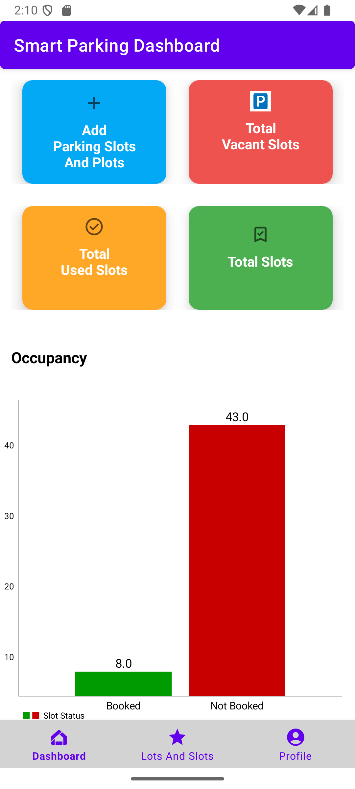
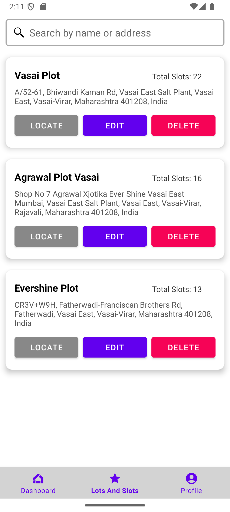
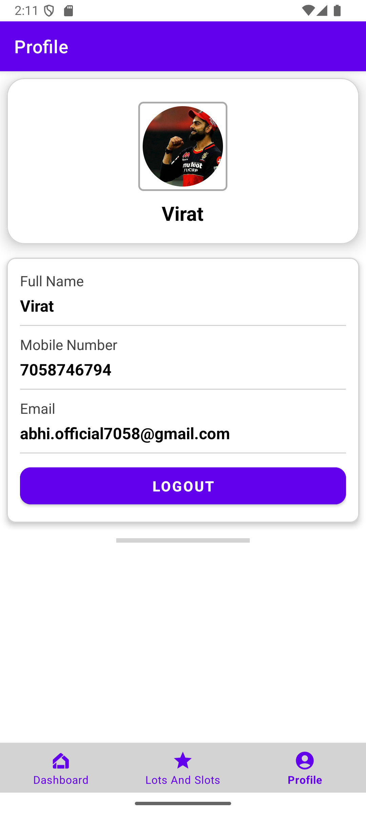
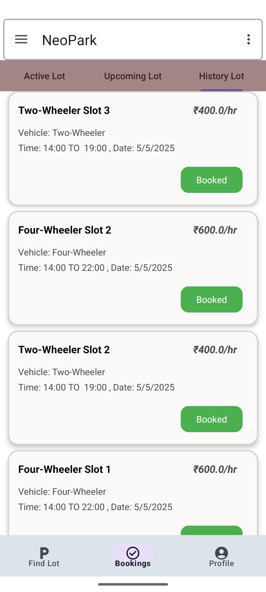
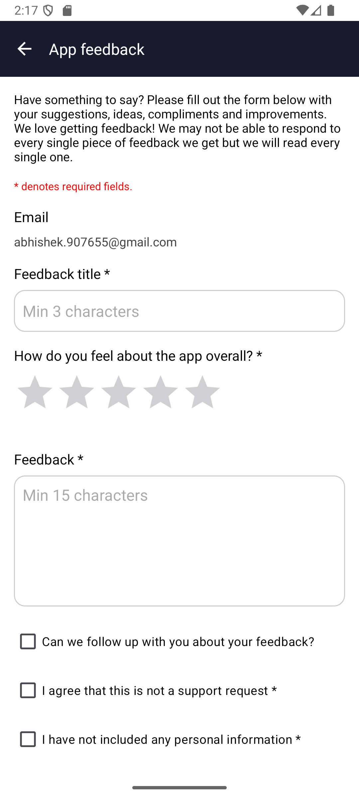
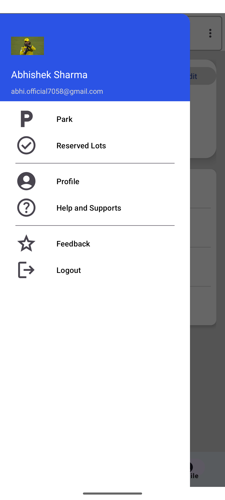

# Online_Parking_App

This is an Android-based Smart Parking App developed using Java, MVVM Architecture, Room Database, and Firebase. It includes two panels:

- 👤 **User Panel** – For regular users to view, book, and manage parking slots.
- 🛠️ **Admin Panel** – For parking owners to add/manage plots and slots with location via Google Maps.

---

## 🗂 Features

- 🔐 User Authentication (Email/Phone) using Firebase
- 🗺️ Google Maps Integration for adding plots
- 📦 Firebase Realtime Database + Room Database (offline support)
- 📸 Image support for plots and slots
- 🧠 MVVM Architecture with ViewModel, Repository, and LiveData
- 📶 Internet connectivity check + Background Services

---


# Tech stack used in your Smart Parking System App (User & Admin)

### 🚀 **Frontend (Android App - Java)**

* **Java** – Android app development language
  *→ "Builds Android apps using Java"*

* **Android Studio** – IDE for Android development
  *→ "Develops and tests Android applications"*

* **Material UI** – Google’s design system
  *→ "Creates clean, intuitive user interface"*

---

### 🧠 **Architecture & Patterns**

* **MVVM Architecture** – Model-View-ViewModel pattern
  *→ "Separates logic, UI, and data"*

* **ViewModel** – Lifecycle-aware data management
  *→ "Holds UI data during lifecycle"*

* **LiveData** – Observable data holder
  *→ "Updates UI when data changes"*

* **Repository Pattern** – Manages data sources
  *→ "Provides single source of truth"*

---

### 📦 **Database & Caching**

* **Room Database (SQLite)** – Local database solution
  *→ "Stores structured data offline locally"*

* **Encrypted SharedPreferences** – Secure key-value storage
  *→ "Stores secure data in preferences"*

---

### ☁️ **Backend & Cloud**

* **Firebase Authentication** – Login & identity services
  *→ "Handles secure login and signup"*

* **Firebase Realtime Database** – Cloud-hosted JSON database
  *→ "Stores synced user/plot data"*

---

### 🗺️ **Location & Maps**

* **Google Maps API** – Map rendering & interaction
  *→ "Shows map and user location"*

* **Geocoder API** – Address from coordinates
  *→ "Converts location to readable address"*

---

### 🔧 **Networking & APIs**

* **Retrofit** – REST API client
  *→ "Fetches data from web services"*

* **FastAPI** *(if used in backend)* – Python backend framework
  *→ "Builds fast RESTful backend APIs"*

---

### 🔄 **Background Tasks & Sync**

* **WorkManager** – Background task scheduler
  *→ "Runs background sync or upload"*


------
## 📲 Setup Instructions

### 1. Clone the Repository

```bash
git clone https://github.com/Abhishek-Comps-Engineer/Online_Parking_App.git


---

## 🗺️ 2. Add Google Maps API Key to Manifest

In your `AndroidManifest.xml` (usually in `app/src/main/AndroidManifest.xml`), add this line **within the `<application>` tag**:

```xml
<meta-data
    android:name="com.google.android.geo.API_KEY"
    android:value="YOUR_GOOGLE_MAPS_API_KEY_HERE"/>


3. ## 🔧 Firebase Setup


### 1️⃣ Add `google-services.json`
- Go to [Firebase Console](https://console.firebase.google.com/)
- Select your project → Project Settings → Add App → Android
- Download the `google-services.json`
- Place it in your project at:

### 2️⃣ Update Gradle Files

**Project-level `build.gradle`:**
```gradle
buildscript {
    dependencies {
        classpath 'com.google.gms:google-services:4.3.15' // Use latest
    }
}


App-level:
apply plugin: 'com.google.gms.google-services'


$ ## 📸 Screenshots

### 👤 AdminNeoPark




### 🛠️ NeoPark


[User Home](screenshots/UserPanel_UI/UserHome.png)

[User Profile](screenshots/UserPanel_UI/UserProfile.png)


...........................................................................
